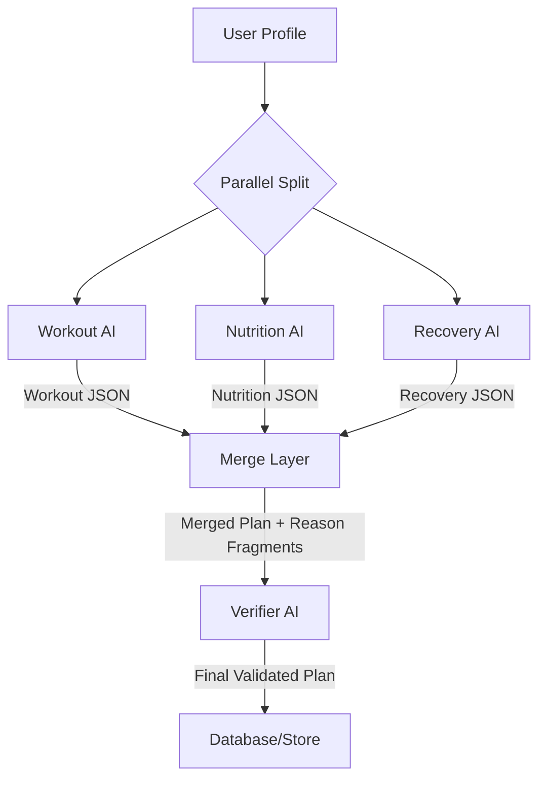

# Parallel Base Plan Generation System: Technical Specification

This document details the architectural redesign of the Base Plan generation pipeline. The goal is to significantly reduce latency and improve plan quality by moving from a monolithic sequential process to a parallelized, multi-agent approach with robust verification.

## 1. Current System Analysis

### 1.1 Existing Pipeline (End-to-End)
- **Entry Point**: `GeneratingBasePlanScreen` (`app/generating-base-plan.tsx`)
    - Initiates `generateWeeklyBasePlan(user)`.
    - Runs diagnostics (`runPlanGenerationDiagnostics`) in production.
    - Displays progress phases with artificial delays.
- **Engine**: `services/basePlanEngine.ts`
    - **Stage 1 (Generation)**: Single monolithic AI call generating the full 7-day plan (Workout + Nutrition + Recovery + Supplements + Reasoning).
    - **Stage 2 (Verification)**: Single AI call to verify and fix the entire 7-day plan.
    - **Retries**: Max 2 attempts with 2000ms delay.
- **AI Client**: `utils/ai-client.ts`
    - Defaults to DeepSeek with clamped timeouts (60s - 210s).

### 1.2 Latency Sources
1.  **Monolithic Stage-1 Call**: Generating all domains (Workout, Nutrition, Supplements) for 7 days in one pass creates a massive context window and slow token generation.
2.  **Sequential Verification**: The verification step waits for the massive Stage 1 to complete before starting.
3.  **Artificial Delays**: UI phase timers and retry delays add non-computational wait time.
4.  **Diagnostics**: Overhead from pre-flight checks in production.

## 2. Architectural Design: Parallel Execution

### 2.1 High-Level Flow
We will maintain the **Double Validation Pattern** (Generation -> Verification) but split the Generation stage into 3 parallel streams.

1.  **Stage 1: Parallel Generation**
    - **Stream A (Workout AI)**: Generates 7-day Workout plan + 1-sentence reasoning per day.
    - **Stream B (Nutrition AI)**: Generates 7-day Nutrition plan + 1-sentence reasoning per day.
    - **Stream C (Recovery AI)**: Generates 7-day Recovery/Supplement plan + 1-sentence reasoning per day.
    - *All streams share the same User Profile context.*

2.  **Stage 1.5: Merge & Synthesis**
    - Combine the 3 partial JSONs into a single `WeeklyBasePlan` structure.
    - Aggregate the 1-sentence reasoning fragments into a `reasonFragments` object for each day.

3.  **Stage 2: Verification & Reasoning**
    - **Verifier AI**: Receives the merged plan.
    - **Validation**: Checks constraints (Diet, Injuries, Equipment).
    - **Reasoning Synthesis**: Composes a cohesive 3-5 sentence "Master Reason" for each day by connecting the `reasonFragments` (Workout + Nutrition + Supplements).

### 2.2 Data Flow Diagram


## 3. Implementation Specification

### 3.1 Prompt Engineering (`utils/basePlanPromptBuilder.ts`)

We will introduce `buildParallelGenerationPrompts` to create specialized prompts for each stream.

#### Shared Context
All prompts will include the **User Profile** generated by `buildUserProfile(user)`, ensuring consistent awareness of:
- Goals & Training Level
- Injuries & Limitations
- Equipment
- Dietary Preferences

#### Stream Prompts
1.  **Workout Prompt**:
    - **Role**: Elite Strength Coach.
    - **Focus**: Split distribution, exercise selection, volume, intensity.
    - **Constraint**: Strict adherence to equipment and injuries.
    - **Output**: `days.{day}.workout` + `reasonSnippet`.

2.  **Nutrition Prompt**:
    - **Role**: Elite Sports Nutritionist.
    - **Focus**: Calorie/Protein targets, meal structure.
    - **Constraint**: Strict dietary rules (Veg/Non-veg).
    - **Output**: `days.{day}.nutrition` + `reasonSnippet`.

3.  **Recovery Prompt**:
    - **Role**: Recovery & Supplementation Coach.
    - **Focus**: Sleep, mobility, "Smart Stack" supplements (Current + Add-ons).
    - **Constraint**: Age-optimized recommendations.
    - **Output**: `days.{day}.recovery` + `reasonSnippet`.

### 3.2 Engine Logic (`services/basePlanEngine.ts`)

Refactor `generateRawPlan` to execute in parallel:

```typescript
async function generateRawPlan(user: User) {
  const prompts = buildParallelGenerationPrompts(user);
  
  // Execute in parallel
  const [workout, nutrition, recovery] = await Promise.all([
    generateAICompletion(prompts.workout),
    generateAICompletion(prompts.nutrition),
    generateAICompletion(prompts.recovery)
  ]);

  // Merge Logic
  // 1. Parse all 3 responses
  // 2. Validate day structure (Monday-Sunday) for each
  // 3. Stitch into single object:
  //    days[day] = { 
  //      workout: workout[day], 
  //      nutrition: nutrition[day], 
  //      recovery: recovery[day],
  //      reasonFragments: { ... } 
  //    }
  
  return mergedPlan;
}
```

### 3.3 Verifier Logic (`utils/basePlanPromptBuilder.ts`)

Update `buildVerificationPrompt` to handle reasoning synthesis:

- **Input**: Merged plan containing `reasonFragments`.
- **Instruction**: "For EACH day, combine the small fragments (Workout, Nutrition, Supplements) into a single, cohesive 3-5 sentence 'reason' field. Use Yesterday→Today→Tomorrow logic where possible."
- **Validation**: Continue to enforce hard constraints (Calories, Protein, Injuries).

## 4. Latency & Timeout Strategy

### 4.1 AI Client Configuration (`utils/ai-client.ts`)
- **Remove Minimum**: Eliminate any logic that enforces a minimum wait time.
- **Max Timeout**: Cap the AI timeout at **10 minutes** (`600000ms`) to handle worst-case network scenarios without premature failure.
- **Default**: Set a sensible default (e.g., 3 minutes) if no config is present.

### 4.2 UI Optimization (`app/generating-base-plan.tsx`)
- **Retry Logic**: Set `MIN_RETRY_INTERVAL_MS = 0`. Allow immediate retries if a failure occurs.
- **Progress Feedback**: Remove fixed `setTimeout` phase transitions. Update UI phases based on actual promise resolution (e.g., mark "Structuring weekly workout splits" as done when the Workout AI stream completes).

## 5. Optimization Roadmap

1.  **Skip Diagnostics**: Implement a flag (e.g., `EXPO_PUBLIC_ENABLE_PLAN_DIAGNOSTICS`) to skip pre-flight checks on standard production runs, saving ~1-2 seconds.
2.  **Prompt Trimming**: optimizing the "specialist" prompts to be concise. Since the Verifier handles the final polish, the Stage 1 prompts can be more "technical" and less "narrative", saving tokens.
3.  **Model Selection**: Future capability to route specific streams to faster/cheaper models (e.g., use a lighter model for Recovery/Supplements vs. a stronger model for Workout logic).
